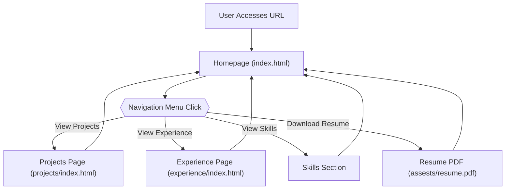

# 🚀 Portfolio Website

<p align="center"></p>

## Short Description
Welcome to the `portfolio_website` repository! This project presents a modern, responsive, and dynamic personal portfolio designed to showcase a developer's skills, projects, and professional experience. Crafted with a focus on engaging user experience and effortless navigation, it's the perfect platform to make a lasting impression on recruiters, collaborators, and potential clients.

## ✨ Key Features
*   **Dynamic & Responsive Design:** A visually appealing and fully responsive interface built with HTML5, CSS3, and JavaScript, ensuring a flawless experience across all devices.
*   **Interactive UI/UX:** Features dynamic elements, animated sections, and particle effects (`particles.min.js`) to captivate visitors.
*   **Comprehensive Sections:** Dedicated areas for showcasing projects, detailing professional experience, and highlighting core technical skills.
*   **Resume Integration:** Provides easy access to download the developer's full resume (`assests/resume.pdf`).
*   **Data-Driven Content:** Projects and skills data are structured in JSON files (`projects/projects.json`, `skills.json`) for straightforward content management and updates.
*   **Custom 404 Page:** A branded and user-friendly error page (`404.html`) to maintain a professional brand even when things go astray.
*   **Automated Deployment:** Includes GitHub Actions workflows (`.github/workflows/ci-cd.yml`) for streamlined Continuous Integration and Deployment.

## Who is this for?
This portfolio is ideal for:
*   **Software Developers & Engineers:** To present their professional profile, expertise, and projects in an organized and impressive manner.
*   **Job Seekers:** To stand out to recruiters and hiring managers with a professional online presence.
*   **Freelancers & Consultants:** To showcase their capabilities and past work to attract new clients.
*   **Anyone seeking inspiration:** For building their own personal branding website.

## Technology Stack & Architecture
This project is a classic example of a robust **Static Front-end Web Application**, leveraging core web technologies for maximum performance and compatibility:

*   **Frontend:**
    *   **HTML5:** For semantic structure and content.
    *   **CSS3:** For modern styling and animations.
    *   **JavaScript:** For interactivity, dynamic content loading, and engaging UI effects (e.g., particles.js).
*   **Build/Deployment:**
    *   **GitHub Actions:** For automated CI/CD pipelines, ensuring rapid and consistent deployments.
*   **Data Management:**
    *   **JSON:** Used for organizing project details and skill sets, allowing for easy updates without modifying core HTML.

## 📊 Architecture & Database Schema
This project follows a client-side architecture without a backend database. The flow describes the user's interaction with the static website:



## ⚡ Quick Start Guide
Get your own version of this impressive portfolio up and running in minutes!

1.  **Clone the repository:**
    ```bash
    git clone https://github.com/ManikantaReddy01/portfolio_website.git
    cd portfolio_website
    ```
2.  **Open in your browser:**
    Simply open the `index.html` file in your preferred web browser, or serve it using a local static file server.
    *(e.g., with Python: `python -m http.server` and navigate to `http://localhost:8000`)*
3.  **Customize your content:**
    *   Edit `index.html`, `projects/projects.json`, and `skills.json` to personalize with your own information, projects, and skills.
    *   Replace `assests/resume.pdf` with your updated resume.
    *   Update images in `assests/images/` as needed.
4.  **Deploy (Optional):**
    Utilize the `.github/workflows/ci-cd.yml` with GitHub Pages or a similar static hosting service for automated deployment.

## 📜 License
This project is licensed under the terms defined in the `LICENSE` file. For full details, please refer to the [LICENSE](LICENSE) file in the repository root.