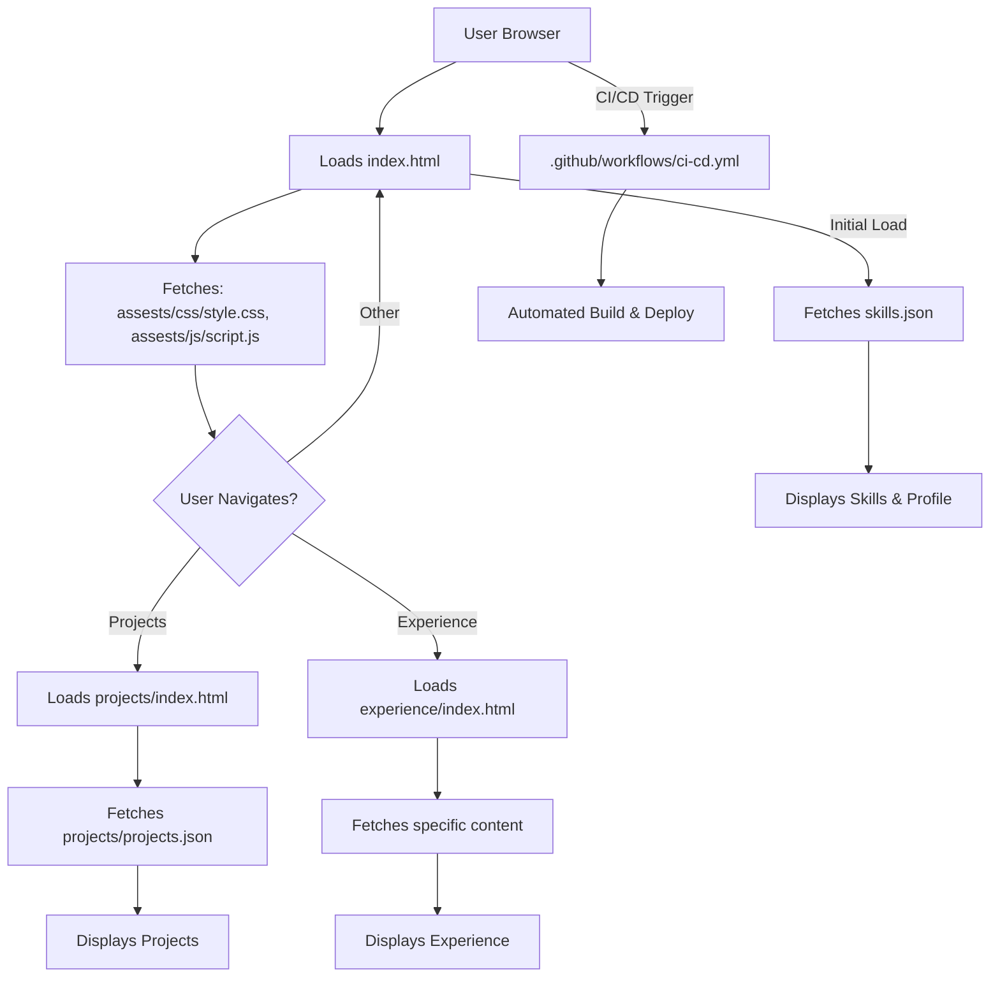

# 🚀 Dynamic Personal Portfolio Website

<p align="center"></p>

## Short Description
Unveiling a captivating and highly customizable personal portfolio website designed to make a lasting impression! This project offers a sleek, responsive, and interactive platform to showcase your skills, projects, and professional journey. Built with a focus on user experience and modern web standards, it's the perfect digital canvas for developers, designers, and professionals to present their unique story to the world.

## ✨ Key Features
*   **Stunning & Responsive UI:** A modern, visually appealing interface that adapts flawlessly across all devices, from desktops to mobile phones.
*   **Comprehensive Project Showcase:** Dedicated section (`projects/`) to highlight your key projects with dynamic data loading from `projects/projects.json`.
*   **Detailed Skills Display:** Clearly outline your technical proficiencies and expertise, powered by a structured `skills.json` file for easy updates.
*   **Professional Experience Section:** Present your work history and achievements in an organized and engaging manner (`experience/`).
*   **Direct Resume Download:** Provide a convenient one-click option for visitors to download your full resume (`assests/resume.pdf`).
*   **Interactive Animations:** Engaging visual effects, possibly powered by libraries like `particles.js`, to enhance user engagement.
*   **Robust CI/CD Integration:** Automated workflows (`.github/workflows/ci-cd.yml`) ensuring seamless deployment and code quality.
*   **Custom 404 Page:** A branded, user-friendly error page to guide visitors back on track.

## Who is this for?
This portfolio website is ideal for:
*   **Software Developers, Web Designers, and Engineers:** To present their technical prowess and project accomplishments.
*   **Freelancers and Consultants:** To attract new clients and showcase their service offerings.
*   **Students and Graduates:** To make a strong impression on recruiters and secure internships or entry-level positions.
*   **Anyone** looking for a professional, easy-to-manage online presence to highlight their career and creativity.

## Technology Stack & Architecture
This project is a testament to robust frontend development practices, leveraging core web technologies for maximum performance and compatibility.

*   **Frontend:**
    *   **HTML5:** For semantic structure and content.
    *   **CSS3:** For modern, responsive styling, including custom styles (`assests/css/style.css`) and specific page styles (`assests/css/404.css`).
    *   **JavaScript:** For dynamic content, interactivity (`assests/js/script.js`, `assests/js/app.js`), and potentially visual enhancements (e.g., `particles.min.js`).
*   **Automation:**
    *   **GitHub Actions:** For continuous integration and continuous deployment (CI/CD) pipelines, ensuring smooth development and automated releases.
*   **Data Storage:**
    *   **JSON Files (`skills.json`, `projects/projects.json`):** Used for managing structured data like skills and project details, allowing for easy updates without touching HTML.

## 📊 Architecture & Database Schema
Given this is a purely frontend, static site, there is no traditional database schema. The architecture revolves around the client-side interaction and content delivery.



## ⚡ Quick Start Guide
Get your personalized portfolio up and running in minutes!

1.  **Clone the repository:**
    ```bash
    git clone https://github.com/ManikantaReddy01/portfolio_website.git
    cd portfolio_website
    ```
2.  **Open in your browser:**
    Simply open the `index.html` file in your preferred web browser to view the live site.
    ```bash
    # For macOS/Linux users (adjust for your system)
    open index.html
    ```
3.  **Customize your content:**
    *   Update your skills in `skills.json`.
    *   Add or modify your projects in `projects/projects.json`.
    *   Replace `assests/resume.pdf` with your own resume.
    *   Personalize the text and images throughout the `index.html`, `experience/index.html`, and `projects/index.html` files.

## 📜 License
This project is licensed under the MIT License. See the `LICENSE` file for more details.